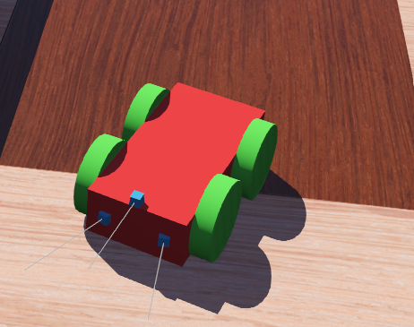
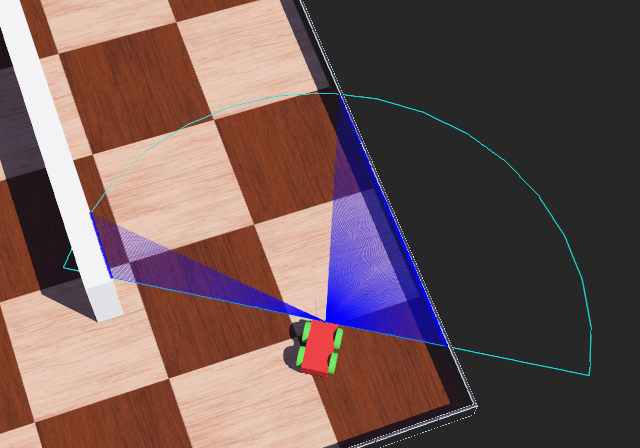

# Perception-and-Obstacle-Detection-using-Virtual-Sensors
Simulated Obstacle Detection with LIDAR. 
Platform: Webots. 
Task: Set up a robot equipped with virtual sensors (e.g., LIDAR, depth) in a 3D environment. They can program the robot to detect and avoid obstacles. 

